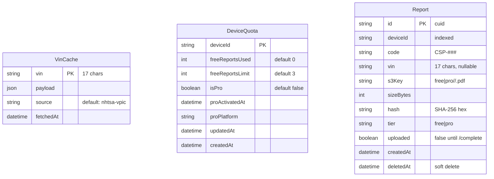
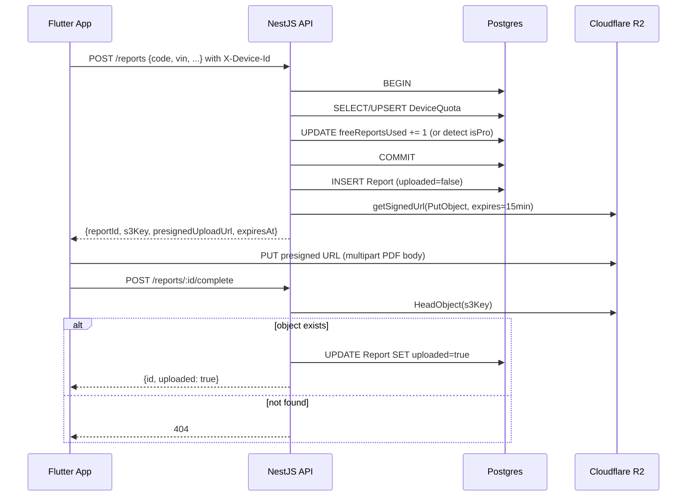
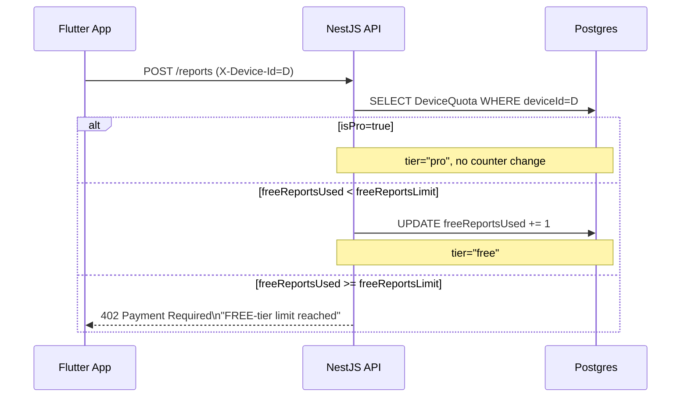

# Architecture

## Module map

```
AppModule
├── ConfigModule (global, Joi-validated)
├── PrismaModule (global)        — PrismaService extends PrismaClient
├── R2Module (global)            — R2Service wraps @aws-sdk/client-s3 + presigners
├── HealthModule                 — /health via @nestjs/terminus
├── VinModule                    — GET /vin/:vin, NHTSA fetch + cache
├── QuotaModule                  — GET /quota, POST /quota/upgrade
├── ReportsModule                — POST/GET/DELETE /reports + /reports/:id/complete
└── MeModule                     — DELETE /me (GDPR erasure)
```

Global cross-cutting concerns wired in `AppModule`:

- `DeviceIdMiddleware` parses `X-Device-Id` on every request.
- `AllExceptionsFilter` standardizes the error envelope (`statusCode`, `error`, `message`, `path`, `timestamp`).
- `LoggingInterceptor` logs `METHOD URL -> STATUS (Nms)`.

## Data model

Three Prisma tables. No foreign keys: `Report` and `DeviceQuota` are independent rows keyed by `deviceId` (string).



## Request flow: report upload (happy path)



## Quota gate (402)



The increment + the gate live inside the same `$transaction`, so concurrent uploads from one device cannot exceed the limit by 1.

## GDPR erasure

`DELETE /me` deletes:

1. Every R2 object under `free/<deviceId>/*` and `pro/<deviceId>/*` (via `ListObjectsV2` + `DeleteObjects` in batches).
2. Every `Report` row for the device (hard delete, not soft).
3. The `DeviceQuota` row.

The operation is idempotent — running it again returns zero counts.

## Retention

- Reports are stored **forever** by design (see `docs/01_Требования_к_системе.md`). No lifecycle rule on the R2 bucket.
- The FREE-tier "limit" is a **lifetime count of generated reports**, not a retention window.
- VinCache rows are never evicted. NHTSA data changes infrequently and a stale entry is acceptable; if a refresh is ever needed, drop the row and the next request will refetch.

## Configuration

All config flows through `@nestjs/config` with a Joi schema (`src/config/env.validation.ts`). The app fails fast on boot if a required production secret is missing. Local development tolerates empty R2 credentials — the `/reports` endpoints return `503 Cloud storage not configured` but the rest of the API remains usable for tests.

## Observability

- **Logs** — Nest's default Logger; `LoggingInterceptor` adds request/response lines. Sensitive values (full device IDs, IAP receipts, R2 secrets) are never logged.
- **Sentry** — `@sentry/node` initializes if `SENTRY_DSN` is set. The default error filter forwards 5xx automatically.
- **Health** — `/health` checks DB ping + R2 `HeadBucket`. Render's liveness probe hits this endpoint.

## What's deliberately not here

- No user / account / session tables.
- No CSRF, no rate limiter (mobile clients only, low volume in MVP).
- No internal admin endpoints (those are Phase 2 site work).
- No background workers or scheduled jobs (uploads are synchronous, history is pull-based).
- No multi-region replication.
